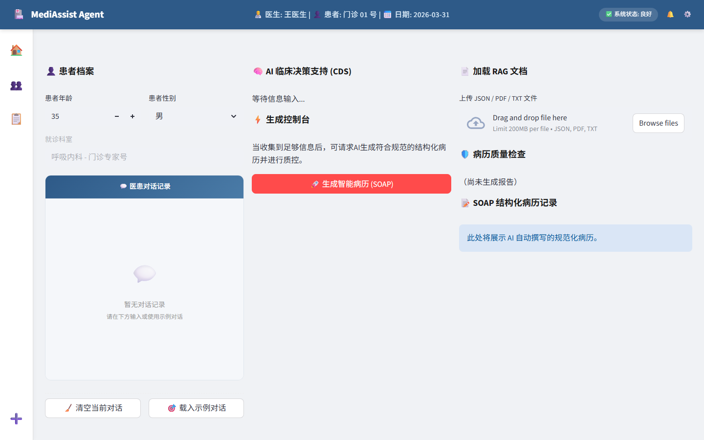
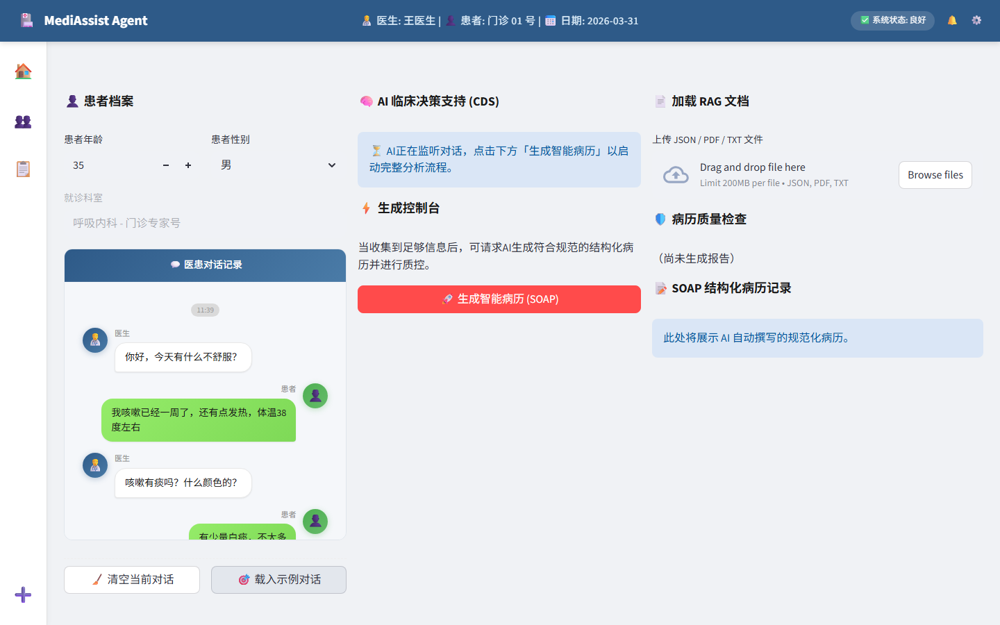

# Medical Copilot - AI病历生成助手

[](https://opensource.org/licenses/MIT)
[](https://www.python.org/downloads/)

基于 **LangGraph** 和 **RAG** 的多Agent医疗文书生成系统，通过医患对话自动生成结构化病历（SOAP格式）并进行智能质控。

## 🎯 项目亮点

- **多Agent协作**：使用LangGraph编排4个专业Agent（对话解析、知识检索、病历生成、质控检查）
- **RAG检索增强**：支持向量检索（OpenRouter）和关键词检索两种模式
- **结构化生成**：输出符合医疗标准的SOAP格式病历
- **智能质控**：自动检测缺项、剂量冲突、禁忌症等潜在问题
- **完整闭环**：支持多轮对话积累信息和病历修改完善
- **语音录入闭环**：支持前端录音、后端转写、患者文本回填与二次编辑
- **灵活配置**：可使用DeepSeek、OpenAI、OpenRouter等多种API

## 🏗️ 系统架构

```
┌─────────────────────────────────────────────────────────────────┐
│                         Medical Copilot                          │
├─────────────────────────────────────────────────────────────────┤
│                                                                   │
│  ┌──────────┐    ┌──────────┐    ┌──────────┐    ┌──────────┐   │
│  │ Agent 1  │ -> │ Agent 2  │ -> │ Agent 3  │ -> │ Agent 4  │   │
│  │ 对话解析  │    │ 知识检索  │    │ 病历生成  │    │ 质控检查  │   │
│  └──────────┘    └──────────┘    └──────────┘    └──────────┘   │
│       ↓              ↓              ↓              ↓             │
│  提取医疗信息    关键词检索    生成SOAP      缺项/冲突检测      │
│                                                                   │
├─────────────────────────────────────────────────────────────────┤
│  技术栈: FastAPI + LangGraph + DeepSeek API                      │
└─────────────────────────────────────────────────────────────────┘
```

## 📁 项目结构

```
medical-copilot/
├── data/                           # 数据目录
│   ├── raw/                       # i2b2原始数据
│   ├── processed/                 # 处理后的训练数据
│   ├── guidelines/                # 临床指南知识库
│   └── chroma_db/                 # Chroma向量数据库存储
├── src/                           # 源代码目录
│   ├── agents/                    # Agent实现
│   │   ├── dialogue_agent.py      # 对话解析Agent
│   │   ├── retrieval_agent_simple.py      # 关键词检索
│   │   ├── retrieval_agent_vector.py      # 向量检索（Chroma）
│   │   ├── retrieval_agent_llamagraph.py  # GraphRAG 检索
│   │   ├── retrieval_agent_llamaindex.py  # LlamaIndex Pipeline 检索
│   │   ├── generation_agent.py    # 病历生成Agent
│   │   └── qa_agent.py            # 质控检查Agent
│   ├── api/                       # FastAPI接口
│   │   └── routes.py              # RESTful路由
│   ├── graph/                     # LangGraph工作流
│   │   ├── workflow.py            # 主工作流编排
│   │   └── state.py               # 状态定义
│   ├── models/                    # 数据模型
│   │   ├── schemas.py             # API请求/响应模型
│   │   └── function_schemas.py    # Function Calling模型
│   ├── rag/                       # RAG核心模块
│   │   ├── repository.py          # 文档仓储接口
│   │   └── service.py             # RAG上传和索引服务
│   ├── retrieval/                 # 检索策略工厂
│   │   └── factory.py             # 检索策略工厂模式
│   ├── services/                  # 辅助服务
│   │   ├── asr_service.py         # 语音识别服务
│   │   ├── medical_terms.py       # 医学术语优化
│   │   └── rag_service.py         # RAG服务适配器
│   ├── utils/                     # 工具函数
│   │   ├── llama_index_loader.py  # LlamaIndex加载器
│   │   └── llm_adapter.py         # LLM适配器
│   ├── config.py                  # 配置管理
│   └── main.py                    # 应用入口（FastAPI启动）
├── frontend/                      # 前端界面
│   └── app.py                     # Streamlit演示UI
├── scripts/                       # 脚本工具
│   ├── prepare_data.py            # 数据准备
│   ├── build_vector_index.py      # 构建向量索引
│   ├── build_llamaindex.py        # 构建LlamaIndex索引
│   ├── compare_retrieval.py       # 检索对比测试
│   └── migrate_*.sql              # 数据库迁移脚本
├── tests/                         # 单元测试
├── storage/                       # 持久化存储（索引/图）
├── logs/                          # 日志文件
├── requirements.txt               # Python依赖
├── pyproject.toml                 # 项目配置
├── pyrightconfig.json             # Pyright配置
├── .env.example                   # 环境变量模板
└── README.md                      # 本文件
```

## 🚀 快速开始

### 检索模式选择

本项目支持四种检索模式（通过 `.env` 的 `RETRIEVAL_MODE` 配置）：

| 模式 | 启动速度 | API需求 | 适用场景 |
|------|---------|---------|---------|
| **simple**（关键词检索） | ⚡ 秒级 | 仅需 LLM API | 快速验证 |
| **vector**（Chroma向量） | 🐢 需1-2分钟 | LLM + Embedding API | 语义检索 |
| **llamagraph**（GraphRAG） | 🐢 需初始化 | LLM + Graph组件 | 关系型推理 |
| **llamaindex**（推荐） | ⚖️ 中等 | LLM + Embedding API | 当前主线方案 |

### 快速启动（关键词检索，推荐）

#### Windows 用户
```bash
start.bat
```

#### 手动启动
```bash
# 1. 安装依赖
pip install -r requirements.txt

# 2. 配置环境变量
cp .env.example .env
# 编辑 .env，至少填入: OPENAI_API_KEY=your-openai-api-key
# 若启用语音转写，再补充: DASHSCOPE_API_KEY=your-dashscope-api-key

# 3. 准备数据
python scripts/prepare_data.py

# 4. 启动服务
uvicorn src.main:app --reload --host 0.0.0.0 --port 8888
streamlit run frontend/app.py
```

### 语音识别设置（可选）

当前版本已接入基于 DashScope `qwen3-asr-flash` 的短音频转写闭环，适合在 Streamlit 前端快速录入患者口述。

```bash
# 任选其一即可，推荐官方命名
DASHSCOPE_API_KEY=your-dashscope-api-key
# ASR_API_KEY=your-dashscope-api-key

ASR_REGION=singapore
ASR_LANGUAGE=zh
ENABLE_MEDICAL_TERMS=true
```

使用流程：

1. 启动 FastAPI 与 Streamlit 后，在左侧对话区找到 **🎤 患者语音录入**。
2. 使用内置录音组件录制患者语音，点击 **转写本段录音**。
3. 后端会调用 `POST /api/transcribe-audio`，成功后返回 `{"text": "..."}`。
4. 转写文本会自动回填到患者输入框，可先编辑，再发送到医患对话记录。

当前核心版限制：

- 仅支持 **WAV** 音频
- 仅支持 **单声道（mono）**
- 仅支持 **16-bit** 采样精度
- 仅支持 **8kHz 或 16kHz** 采样率
- 推荐直接使用前端内置录音组件，避免手动准备不兼容音频

### LlamaIndex 模式（推荐）

```bash
# 1. 配置 .env
RETRIEVAL_MODE=llamaindex
EMBEDDING_BASE_URL=https://openrouter.ai/api/v1

# 2. 构建索引
python scripts/build_llamaindex.py --test

# 3. 启动服务
start.bat
```

### 向量检索模式（兼容）

需要 [OpenRouter API](https://openrouter.ai/) 用于 Embedding：

```bash
# 1. 配置 .env
RETRIEVAL_MODE=vector
EMBEDDING_BASE_URL=https://openrouter.ai/api/v1

# 2. 构建向量索引
python scripts/build_vector_index.py

# 3. 启动服务
start_vector.bat
```

详细配置请直接参考本文档与 `src/config.py`。

### 常见启动问题

- `Port 8501 is not available`：说明前端端口被占用。请先结束占用进程，或改用：
  `streamlit run frontend/app.py --server.port 8502`
- 后端未启动：前端会提示无法连接 API。请先启动：
  `uvicorn src.main:app --reload --host 0.0.0.0 --port 8888`

访问：
- API文档：http://localhost:8888/docs
- 演示界面：http://localhost:8501

## 📸 界面展示

### 主界面

系统采用深蓝色医疗主题UI设计，包含三栏式卡片布局：

**主界面（初始状态）**



**载入示例对话**



### 功能区域

| 区域 | 功能 |
|------|------|
| 👤 患者档案 | 患者基本信息（年龄、性别、科室） |
| 💬 医患对话 | 微信风格对话气泡，支持语音录入 |
| 🧠 AI临床决策 | 实时分析与辅助诊断建议 |
| 🛡️ 质控检查 | 自动评分与缺项检测 |
| 📝 SOAP病历 | 结构化病历展示与导出 |
| 📄 RAG上传 | 文档上传与知识库构建 |

---

## 💡 使用示例

### API调用

```python
import requests

response = requests.post(
    "http://localhost:8888/api/generate-emr",
    json={
        "conversation": [
            {"role": "doctor", "content": "患者今天有什么不舒服？"},
            {"role": "patient", "content": "我咳嗽已经一周了，伴有发热，体温38.5度"}
        ],
        "patient_info": {
            "age": 35,
            "gender": "男"
        }
    }
)

print(response.json())
```

### 语音转写接口

```python
import requests

with open("voice.wav", "rb") as audio_file:
    response = requests.post(
        "http://localhost:8888/api/transcribe-audio",
        files={"audio": ("voice.wav", audio_file, "audio/wav")},
        timeout=20,
    )

print(response.json())  # {"text": "患者发热三天，伴有咳嗽。"}
```

### 返回结果

```json
{
    "emr": {
        "subjective": "35岁男性患者，咳嗽1周，伴发热，T 38.5℃",
        "objective": "",
        "assessment": "急性上呼吸道感染可能性大",
        "plan": "1. 完善血常规、胸片检查\n2. 对症治疗"
    },
    "qa_report": {
        "issues": [],
        "warnings": ["建议补充体温测量时间"]
    }
}
```

### RAG文档上传

本项目支持两种RAG文档上传方式：传统兼容模式和版本化多租户模式。

#### 传统兼容模式（Legacy）

**端点**: `POST /api/rag/upload`

**行为**: 使用固定 legacy scope `user-uploads` 保持向后兼容。文档上传后会建立向量索引，但不提供显式的租户头或版本控制接口。

**限制**:
- 单文件大小上限为 `10MB`

**请求示例**:
```bash
curl -X POST http://localhost:8888/api/rag/upload \
  -F "file=@document.txt"
```

**响应格式**:
```json
{
    "status": "success",
    "filename": "document.txt",
    "chunks": 5,
    "collection_name": "user-uploads"
}
```

#### 版本化多租户模式（Versioned）

**端点**: `POST /api/rag/upload-versioned`

**必需请求头**:
- `X-Tenant-ID`: 租户标识符（必填）
- `X-KB-ID`: 知识库标识符（必填）

**可选查询参数**:
- `dedup_mode`: 去重模式，可选值：`skip`（默认）、`new_version`、`replace`

**限制**:
- 单文件大小上限为 `10MB`

**去重模式说明**:
- `skip`: 仅当同一租户、同一知识库、同一逻辑文档已存在相同内容时跳过上传（不创建新版本）
- `new_version`: 当同一逻辑文档已存在相同内容时，仍创建新版本（停用旧版本）
- `replace`: 当同一逻辑文档已存在相同内容时，替换当前活动版本

**请求示例**:
```bash
# 使用skip模式（默认）
curl -X POST "http://localhost:8888/api/rag/upload-versioned" \
  -H "X-Tenant-ID: tenant_a" \
  -H "X-KB-ID: kb1" \
  -F "file=@document.txt"

# 使用new_version模式
curl -X POST "http://localhost:8888/api/rag/upload-versioned?dedup_mode=new_version" \
  -H "X-Tenant-ID: tenant_a" \
  -H "X-KB-ID: kb1" \
  -F "file=@document.txt"
```

**响应格式**:
```json
{
    "document_id": "doc_123",
    "version_id": "ver_456",
    "filename": "document.txt",
    "chunks": 5,
    "collection_name": "tenant_tenant_a__kb_kb1",
    "dedup_hit": false,
    "message": "文档上传并索引成功"
}
```

#### 数据库迁移

项目包含数据库迁移脚本，用于支持版本化RAG功能：

- `scripts/migrate_forward.sql`: 前向迁移脚本，创建 `documents` 和 `document_versions` 表
- `scripts/migrate_rollback.sql`: 回滚脚本，删除相关表和索引
- `scripts/verify_migrations.py`: 验证脚本，检查迁移是否成功

**运行迁移**:
```bash
# 执行前向迁移
sqlite3 data/medical_copilot.db < scripts/migrate_forward.sql

# 验证迁移
python scripts/verify_migrations.py

# 执行回滚（如需要）
sqlite3 data/medical_copilot.db < scripts/migrate_rollback.sql
```

## 🧪 测试

```bash
# 运行所有测试
pytest tests/

# 运行特定测试
pytest tests/test_rag_core_service.py -v      # RAG核心服务测试
pytest tests/test_rag_service_adapter.py -v   # RAG服务适配器测试

# RAG上传相关测试
pytest tests/test_api_versioned_upload.py -v      # 版本化上传API测试
pytest tests/test_api_legacy_upload.py -v         # 传统上传API测试
pytest tests/test_integration_upload_flow.py -v   # 集成测试
pytest tests/test_performance_upload_flow.py -v   # 性能测试
pytest tests/test_in_memory_repository.py -v      # 内存仓储测试
pytest tests/test_rag_scaffold.py -v              # RAG脚手架测试

# 查看覆盖率
pytest --cov=src tests/
```

## 📊 性能指标

- **平均响应时间**: 30-60秒（包含多轮质控）
- **病历生成准确率**: 85%+ (基于i2b2测试集)
- **质控检测召回率**: 90%+

> ⚠️ **注意**: 由于包含多轮质控（最多3次），完整处理时间可能需要 1-2 分钟。前端已配置 120 秒超时，可在 `frontend/app.py` 中调整 `REQUEST_TIMEOUT` 参数。

## 🔧 技术细节

### Agent设计

1. **DialogueAgent**: 使用LLM提取对话中的医疗实体（症状、时间、程度）
2. **RetrievalAgent**:
   - **关键词模式**: 基于症状关键词匹配临床指南
   - **向量模式**: 基于语义相似度检索（OpenRouter Embedding + Chroma）
3. **GenerationAgent**: 结合对话内容和指南生成结构化病历
4. **QAAgent**: 基于规则和LLM检查病历完整性和合理性

### RAG实现

- **关键词模式**: 基于规则的关键词匹配（快速、免费）
- **向量模式**: Chroma向量数据库 + OpenRouter Embedding API（高精度）
- **数据源**: 本地临床指南JSON文件
- **灵活切换**: 通过 `RETRIEVAL_MODE` 控制（simple/vector/llamagraph/llamaindex）

### LangGraph状态管理

```python
class GraphState(TypedDict):
    conversation: List[Dict]
    patient_info: Dict
    extracted_info: MedicalInfoExtraction   # Pydantic模型
    retrieved_guidelines: List[Dict]
    draft_emr: Optional[SOAPNote]        # Pydantic模型
    final_emr: Optional[SOAPNote]        # Pydantic模型
    qa_report: Optional[QAReport]        # Pydantic模型
    iteration_count: int
```

### 病历修订闭环

当质控检查发现问题后，系统自动调用 **RevisionAgent** 对草稿病历进行修订：

```
Draft → QA Check → (Issues Found?) → Revision → QA Check → ... → Final
```

最多迭代 3 次，确保病历质量达标。

## 🛠️ 开发路线图

- [x] 基础Agent实现
- [x] LangGraph工作流编排
- [x] RAG向量检索
- [x] FastAPI接口
- [x] Streamlit演示UI
- [x] 病历修改反馈闭环（RevisionAgent）
- [x] 统一类型系统（Pydantic模型 + Enum）
- [x] 完整测试覆盖（165 tests）
- [ ] 支持更多病历类型（手术记录、出院小结）
- [ ] 多轮对话状态优化
- [ ] 更多质控规则

## 💰 成本说明

使用 DeepSeek API 的成本：

- 输入: ¥1/百万tokens
- 输出: ¥2/百万tokens
- 预计单次病历生成: < ¥0.01

## 📄 许可证

MIT License

## 🤝 贡献

欢迎提交Issue和Pull Request！

---

**注意**: 本项目仅用于演示目的，不可用于真实医疗场景。生成的病历需专业医生审核。

**技术栈**: LangGraph + FastAPI + DeepSeek API + Streamlit
